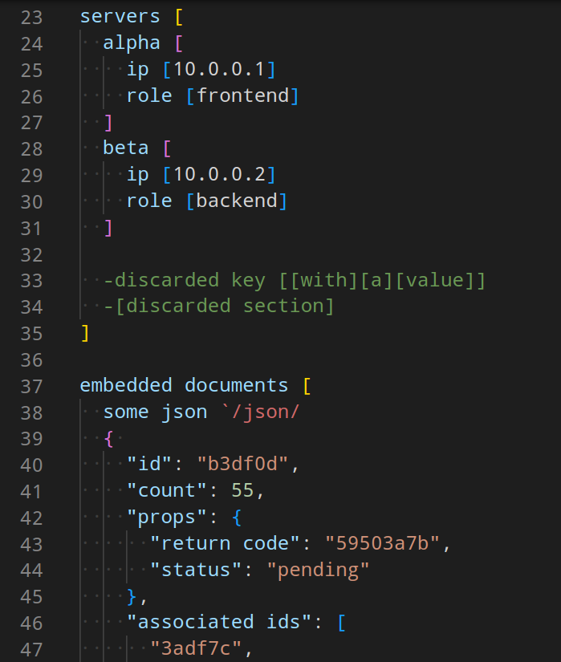
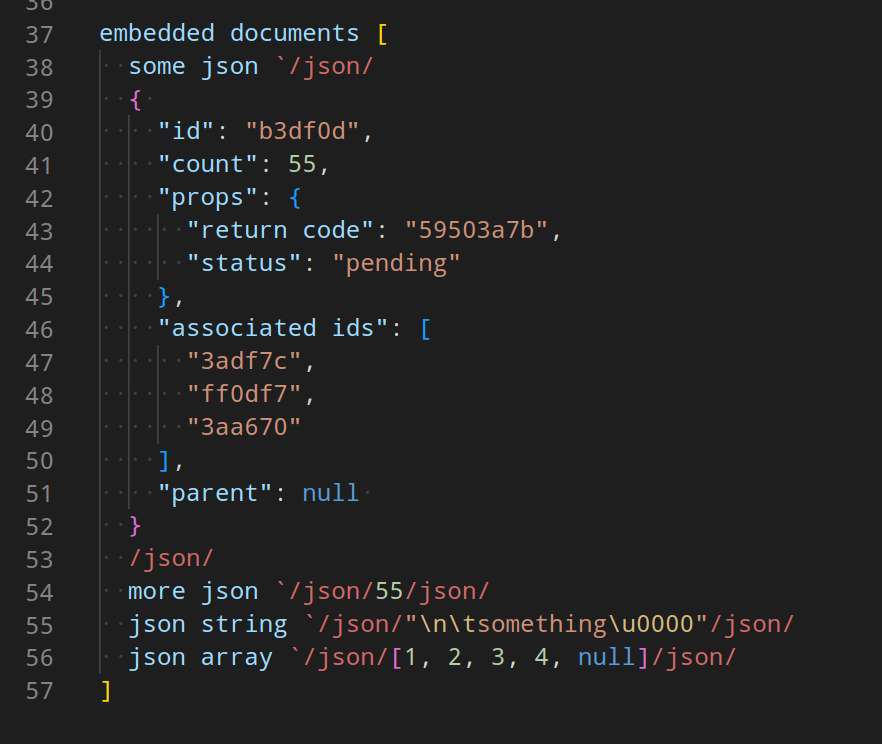

<p align="center" style="text-align: center;">
<br/>
<a href="https://jevko.org">jevko.org</a><br/>
<span>[EXPERIMENTAL]</span>
</p>

⚠️⚠️⚠️ THIS EXTENSION DEPRECATES AND CONFLICTS WITH: ⚠️⚠️⚠️

* [jevkodata-basic-highlighting](https://github.com/jevko/jevkodata-basic-highlighting-vscode): [Visual Studio Marketplace](https://marketplace.visualstudio.com/items?itemName=jevko.jevkodata-basic-highlighting) | [Open VSX Registry](https://open-vsx.org/extension/jevko/jevkodata-basic-highlighting)

* [jevkoml-basic-highlighting](https://github.com/jevko/jevkoml-basic-highlighting-vscode): [Open VSX Registry](https://open-vsx.org/extension/jevko/jevkoml-basic-highlighting) | [Visual Studio Marketplace](https://marketplace.visualstudio.com/items?itemName=jevko.jevkoml-basic-highlighting)

⚠️⚠️⚠️ PLEASE UNINSTALL/DISABLE THESE EXTENSIONS BEFORE INSTALLING THIS ONE ⚠️⚠️⚠️

# Jevko Interface

Jevko interface for Visual Studio Code.

This extension is published to the [Visual Studio Marketplace](https://marketplace.visualstudio.com/items?itemName=jevko.jevko) as well as the [Open VSX Registry](https://open-vsx.org/extension/jevko/jevko).

## Installation

Launch VS Code Quick Open (Ctrl+P), paste the following command, and press enter.

```
ext install jevko.jevko
```

## Features

### Syntax highlighting

#### .jevkodata

<p align="center" style="text-align: center;">

</p>

Basic syntax highlighting for .jevkodata in Visual Studio Code.

<!-- todo: better screenshots/gifs -->




#### .jevkomarkup

<p align="center" style="text-align: center;">

</p>

Basic syntax highlighting for .jevkoml that works in Visual Studio Code.


### Actions on save

If you put the following at the top of your .jevkodata file:

```
[
  output [NAME.json]
]
```

where `NAME` is some file name chosen by you, the .jevkodata file will be automatically converted to the specified .json file on save (Ctrl+S).

Similarly, you can put:

```
[
  output [NAME.html]
]
```

on top of your .jevkoml file and it will be converted to the specified .html file on save (Ctrl+S).

<!-- todo: pictures/videos -->

### Commands

#### Jevko: translate current file

Press Ctrl+Shift+P and select the `Jevko: translate current file` command to convert current file to another format.

The following conversions are supported:

* .jevkodata -> .json
* .json -> .jevkodata
* .jevkoml -> .xml

[](https://youtu.be/ElY8SABBQWM)

[Demo video: translating between .jevkodata and .json](https://youtu.be/ElY8SABBQWM)

<!-- todo: more accurate description -->

<!-- #### .jd -> .json -->
<!-- #### .jevkodata -> .json

With this extension, when you save a .jd file, it is automatically converted to and saved as a corresponding JSON file. -->

<!-- #### .jm -> .xml or .html -->
<!-- #### .jevkoml -> .xml or .html

With this extension, when you save a .jm file, it is automatically converted to and saved as a corresponding XML/HTML file. -->

<!-- todo: implement -->
<!-- ### Conversion commands

You can convert a JSON file to .jd with the `Jevko: save JSON as JD` command. -->

## Release Notes

See [CHANGELOG.md](CHANGELOG.md).
